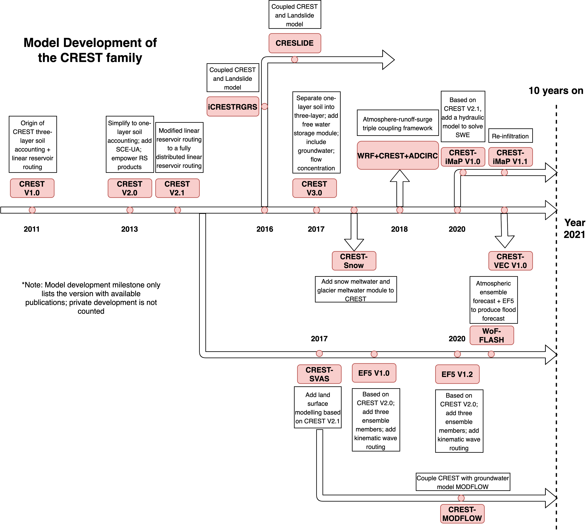

.. CREST-family documentation master file, created by
   sphinx-quickstart on Mon Nov  8 15:07:44 2021.
   You can adapt this file completely to your liking, but it should at least
   contain the root `toctree` directive.

Welcome to CREST-family!
========================================

Cite our paper!

Li, Z., Xue, X., Clark, R., Vergara, H., Gourley, J., Tang, G., Shen, X., Kan, G., Zhang, K., Wang, J., Chen, M., Gao, S., Zhang, J., Yang, T., Wen, Y., Kirstetter, P., Hong, T. A decadal review of the CREST model family: Developments, applications, and outlook, Journal of Hydrology X, 2023, doi: 10.1016/j.hydroa.2023.100159.

.. toctree::
   :maxdepth: 2
   :caption: Contents:

   crestV1
   crestV2
   crestV3
   EF5
   coupling
   applications
   contributing
   references
   

Indices and tables
==================

* :ref:`genindex`
* :ref:`modindex`
* :ref:`search`

.. Note:: The CREST model, namely Coupled Routing and Excess STorage, developed at the University of Oklahoma and National Aeronautics and Space Administration (NASA), is a distributed hydrologic model aiming to but not limited to predicting riverine floods in a fast implementation. 

   Figure 1. Map of showing CREST model evolution.

